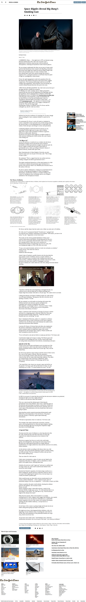

# New York Times Article

>  Clone a New York Times Article

Solo Project practising positioning and floats by replicating a clone of a New york times Article

## Built With

- HTML & CSS
- Visual Studio Code

## Live Demo

[Live Demo Link](https://julianaosemeke.github.io/NewYorkTimesArticle/)

## Authors

👤 **Juliana Osemeke**

- GitHub: [@JulianaOsemeke](https://github.com/JulianaOsemeke)
- Twitter: [https://twitter.com/julianaosemeke](@JulianaOsemeke)
- LinkedIn: [https://ng.linkedin.com/in/juliana-osemeke](https://linkedin.com/linkedinhandle)

## 🤝 Contributing

Contributions, issues, and feature requests are welcome!

Feel free to check the [issues page](issues/).

## Show your support

Give a ⭐️ if you like this project!

## 📝 License

This project is [MIT](lic.url) licensed.
